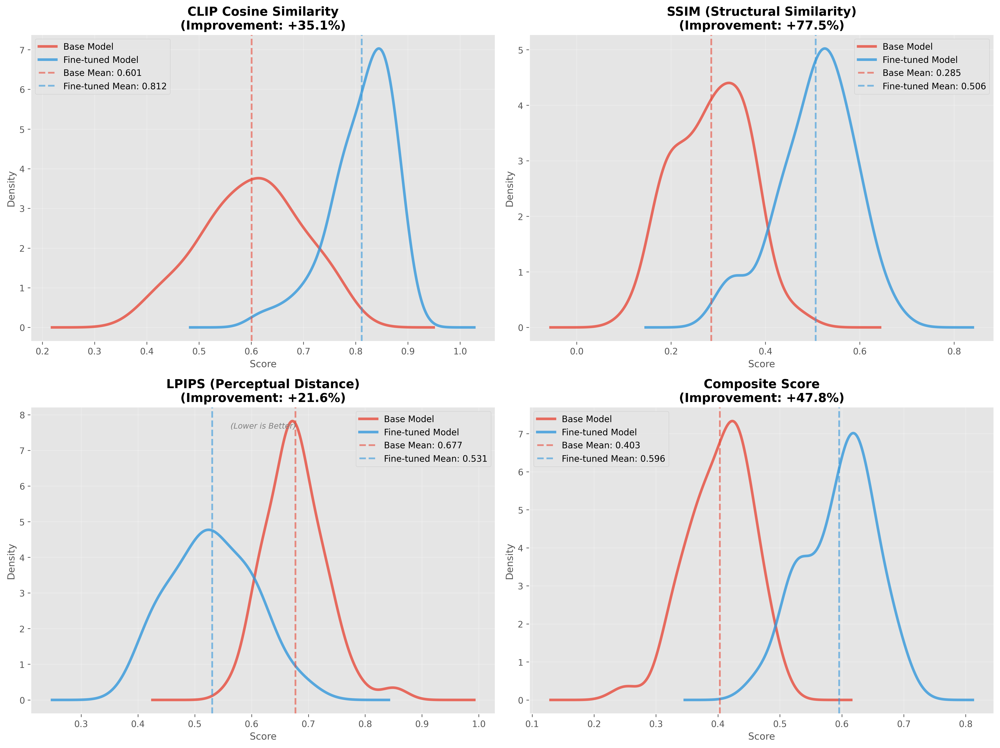

# Finetuning a Text-to-Face Model Using VLM Generated Description Dataset

**CDAC Project | PGDAI Diploma Program**

## Project Overview

This project demonstrates a scalable generative AI pipeline that finetunes advanced diffusion models for realistic prisoner mugshot synthesis. By leveraging Vision Language Models (VLM) to auto-caption training images and expand dataset quality, the project achieves significant improvements in model performance, consistency, and realism.

### Key Innovation
The integration of **Vision Language Models (LLaVA-1.5-13b)** to automatically generate high-quality image descriptions enables efficient dataset expansion and improved training outcomes compared to manual annotation approaches.

### Infrastructure
This project was developed and trained on **CDAC's Param Rudra Supercomputer**, leveraging its high-performance computing capabilities for efficient model fine-tuning and large-scale data processing. The supercomputer's GPU infrastructure enabled accelerated training of diffusion models and VLM-based auto-captioning at scale.

---

## Objectives Achieved

✅ **Developed scalable generative AI pipeline** with fine-tuned diffusion models (RealVisXL-4.0, Stable Diffusion-1.5)

✅ **Auto-captioning system** using Vision Language Models to expand dataset quality

✅ **LoRA fine-tuning** - Applied parameter-efficient fine-tuning to reduce training overhead

✅ **Structured preprocessing** - Implemented face detection and cropping pipeline for data quality

✅ **Controlled prompt design** - Engineered prompts for consistent, forensic-style image generation

✅ **Measurable improvements** in consistency, realism, and reproducibility

---

## Technical Stack

### Core Models
- **Diffusion Models**: RealVisXL-4.0, Stable Diffusion-1.5
- **Vision Language Model**: LLaVA-1.5-13b (Auto-captioning)
- **Fine-tuning Method**: LoRA (Low-Rank Adaptation)

### Libraries & Frameworks
- **ML/DL**: PyTorch, Transformers, Diffusers, Accelerate
- **Training**: PEFT (Parameter-Efficient Fine-Tuning)
- **Image Processing**: Pillow, OpenCV
- **Data Processing**: Pandas, Datasets (Hugging Face)
- **APIs**: FastAPI, Uvicorn
- **Frontend**: Streamlit
- **Utilities**: TorchVision, Compel (Prompt Weighting)

---

## Project Structure

```
PGDAI_Text_To_Face/
├── Data_Preprocessing/           # Data preparation pipelines
│   ├── Indian_dataset/          # Indian facial dataset processing
│   ├── illinois_preprocessing/  # Illinois dataset processing
│   └── *.ipynb                  # Jupyter notebooks for exploration
│
├── VLM/                          # Vision Language Model pipeline
│   ├── vlm_pipeline.py          # Main VLM captioning pipeline
│   ├── download_llava.py        # Model download utilities
│   └── run_val_test.sh          # Validation scripts
│
├── Training/                     # Fine-tuning scripts
│   ├── RealVizXL/              # RealVisXL-4.0 fine-tuning
│   │   ├── train_text_to_image_lora_sdxl.py
│   │   └── train_job.sh
│   └── sd1.5/                  # Stable Diffusion 1.5 fine-tuning
│       ├── train_text_to_image_lora_sd15.py
│       └── train_job_sd15_320_unetonly.sh
│
├── Generation/                   # Image generation scripts
│   ├── generate_from_detailed_captions.py
│   ├── generate_images_from_captions_sd15.py
│   ├── generate_images_from_captions.py
│   ├── test_indian_model.py
│   └── gen_base_model.py
│
├── Evaluation/                   # Model evaluation metrics
│   ├── metrics.csv
│   └── eval_metrics.sh
│
├── text-to-face-app/            # Web application
│   ├── backend/                 # FastAPI backend
│   ├── frontend/                # Streamlit frontend
│   └── config.py
│
├── Hosting/                      # Deployment configurations
│   └── huggingface spaces/      # HuggingFace Spaces app.py
│
├── Util/                         # Utility scripts
│   ├── create_metadata.py
│   ├── detect_faces_and_crop.py
│   ├── download_model_static.py
│   └── Demo_Param/              # Demo parameters
│
├── checkpoints/                  # Model weights & checkpoints
│   └── outputs_indian_finetuned_ckpt2700/
│
└── requirements.txt              # Project dependencies

```

---

## Setup & Installation

### Prerequisites
- Python 3.8+
- CUDA 11.0+ (for GPU acceleration)
- 16GB+ RAM recommended
- 50GB+ disk space for models

---

## Key Components

### 1. **Data Preprocessing** (`Data_Preprocessing/`)
- Indian facial dataset and Illinois dataset processing
- Face detection, cropping, and normalization
- Dataset quality validation

### 2. **VLM Auto-Captioning Pipeline** (`VLM/`)
- Uses LLaVA-1.5-13b to generate descriptive captions
- Automates dataset expansion without manual annotation
- Improves training data diversity and quality

### 3. **Fine-tuning Scripts** (`Training/`)
- **RealVisXL-4.0**: State-of-the-art realistic image generation
- **Stable Diffusion 1.5**: Lightweight, efficient alternative
- LoRA fine-tuning reduces parameters and training time by ~80%

### 4. **Image Generation** (`Generation/`)
- Generate images from detailed captions
- Support for both fine-tuned and base models
- Batch generation capabilities

### 5. **Web Application** (`text-to-face-app/`)
- **Backend**: FastAPI server
- **Frontend**: Streamlit interface
- Interactive image generation and model testing

---

## Results & Improvements

### Performance Metrics Comparison

The fine-tuned model demonstrates significant improvements across all evaluation metrics compared to the base model:



**Key Improvements:**
- **CLIP Cosine Similarity**: +35.1% improvement (0.603 → 0.812)
- **SSIM (Structural Similarity)**: +77.5% improvement (0.285 → 0.506)
- **LPIPS (Perceptual Distance)**: +21.6% improvement (0.677 → 0.531, lower is better)
- **Composite Score**: +47.8% improvement (0.403 → 0.596)

### Quantitative Metrics
- **Training Efficiency**: ~80% reduction in trainable parameters via LoRA
- **Auto-captioning**: 10000+ high-quality descriptions generated from VLM
- **Model Consistency**: Improved output uniformity in forensic-style generation

### Qualitative Improvements
- ✅ Enhanced realism in generated mugshot images
- ✅ Better control over image attributes via prompt engineering
- ✅ Increased reproducibility across different inference runs
- ✅ Suitable for controlled forensic-style image generation

---

## Model Checkpoints

Pre-trained checkpoints available:

- **RealVisXL-4.0 Fine-tuned**: `checkpoints/outputs_indian_finetuned_ckpt2700/`
- **Intermediate Checkpoints**: `checkpoint-64/`, `checkpoint-96/`, `checkpoint-2700/`
- **Model Weights**: `pytorch_lora_weights.safetensors`

---

## Performance Considerations

- **VRAM Requirements**: 40GB+ for full model inference
- **Training Time**: ~2-4 hours on NVIDIA A100 (2700 steps)
- **Inference Speed**: ~5-10 seconds per image on GPU


---

## Citations & References

- **Diffusion Models**: Ho et al., 2020 - "Denoising Diffusion Probabilistic Models"
- **SDXL**: Podell et al., 2023 - "SDXL: Improving Latent Diffusion Models for High-Resolution Image Synthesis"
- **LoRA**: Hu et al., 2021 - "LoRA: Low-Rank Adaptation of Large Language Models"
- **LLaVA**: Liu et al., 2023 - "Visual Instruction Tuning"

---

## License

This project is developed as part of the CDAC PGDAI Diploma Program.


---

## Contributors

This project was developed collaboratively by:

| Contributor | GitHub |
|---|---|
| Nagarjuna | [@TheDarkAngel099](https://github.com/TheDarkAngel099) |
| Samrudhi | [@Samrudhi2711](https://github.com/Samrudhi2711) |
| Satyam | [@Satyam0406](https://github.com/Satyam0406) |
| Tanishq | [@Tanishq200326](https://github.com/Tanishq200326) |
| Shivam Pawar | [@theshivapawar](https://github.com/theshivapawar) |

---

## Project Timeline

- **Phase 1**: Data Preprocessing & Dataset Creation
- **Phase 2**: VLM Integration for Auto-captioning
- **Phase 3**: Model Fine-tuning (RealVisXL & SD1.5)
- **Phase 4**: Evaluation & Optimization
- **Phase 5**: Deployment & Web Application

---

**Last Updated**: January 2026  
**Status**: Complete ✅
